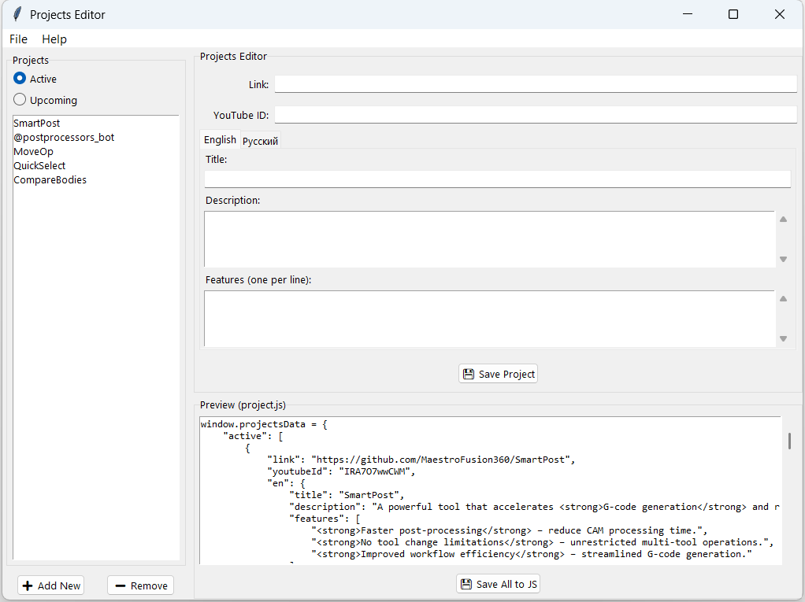

# Projects Editor

A cross-platform GUI application for managing project data with multilingual support.

<details>
  <summary>Click to see the image</summary>
  <h1 align="center">
    
  </h1>
</details>

## Features

- Edit projects with English and Russian content
- Manage active and upcoming projects separately
- Real-time preview of generated JavaScript output
- Cross-platform (Windows, Linux, Mac)
- DPI-aware for high-resolution displays
- Keyboard shortcuts for common operations

## Requirements

- Python 3.6+
- Tkinter (usually included with Python)

## Installation

1. Clone this repository
2. Install dependencies (none required beyond standard library)

## Usage

```bash
python editor.py
```